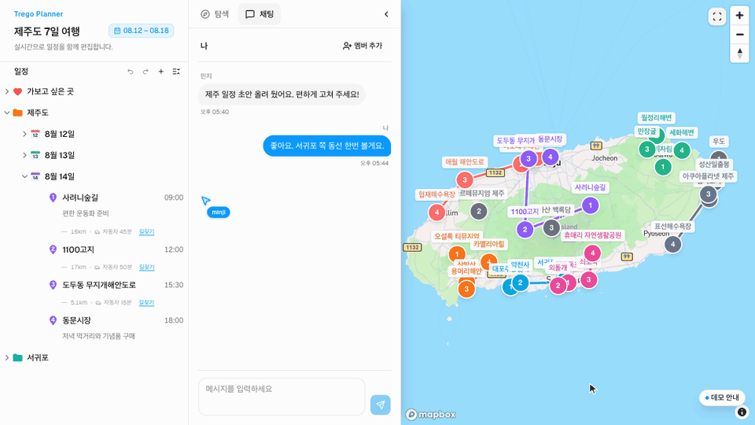
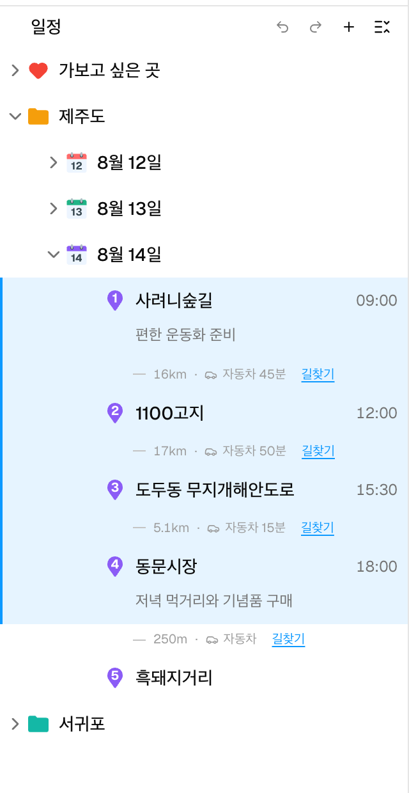
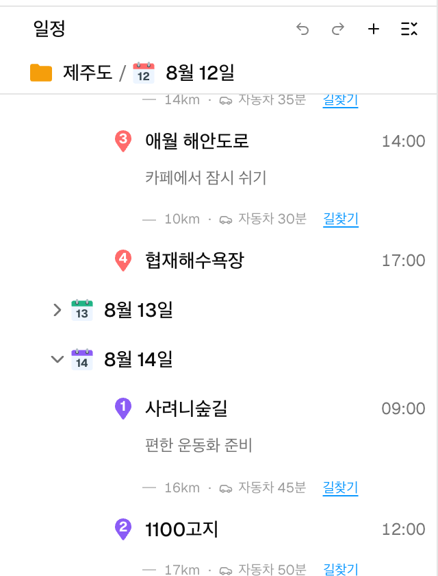
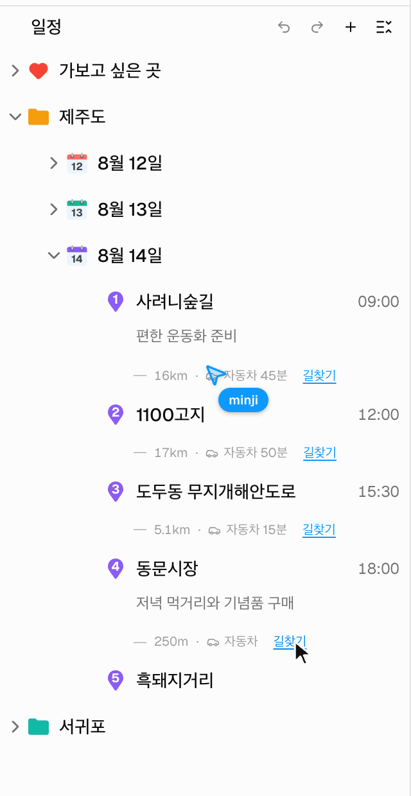
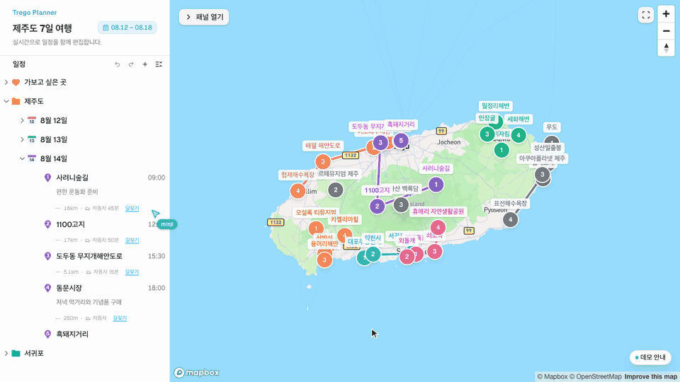

# Trego Planner

**여러 사람이 하나의 계층형 여행 일정을 함께 편집하는 웹 에디터입니다.**

여행 일정은 목록이 아니라 `폴더 → 날짜 → 일정` 트리입니다. 이 저장소가 다루는 문제는 두 가지입니다.

- 깊은 계층 데이터를 사용자가 **학습하지 않고도** 다룰 수 있게 만드는 것
- 그 트리를 여러 사람이 **동시에** 바꿀 때 화면과 서버가 어긋나지 않게 하는 것

**[데모 열기](https://trego-web-portfolio.vercel.app/demo)** — 로그인과 백엔드 없이 바로 편집할 수 있습니다. 가상의 동료가 함께 편집하고 채팅을 보냅니다. 데스크톱 브라우저에서 열어 주세요.



<sub>가상의 동료 「민지」가 일정을 고치고 채팅을 보내는 사이, 일정을 드래그해 순서를 바꾸면 지도 경로도 함께 다시 그려집니다.</sub>

## 배경

**Trego**는 2025년 5월부터 2026년 2월까지 4인 팀(프론트엔드 1, 백엔드 3)이 만든 여행 계획 서비스입니다. 프론트엔드는 제가 설계와 구현을 맡았고, 원본 프론트엔드 커밋의 85%(621/733), 소스 코드 변경 줄의 약 97%를 작성했습니다. 원본 팀 저장소는 비공개입니다.

이 저장소는 그 프론트엔드를 2026년 7월부터 혼자 TypeScript로 다시 만든 것입니다. 아래 문제들은 원본에서 처음 풀었고, 이 저장소에서 다시 구현하며 다듬었습니다.

## 어려웠던 문제

코드는 [planner-drop-rules.ts](src/features/planner/dnd/planner-drop-rules.ts)와 [build-planner-tree.ts](src/features/planner/utils/build-planner-tree.ts)에서 시작하면 흐름을 따라가기 쉽습니다.

### 조회·렌더링·드래그가 같은 트리를 다르게 읽습니다

노드 하나를 바로 찾는 일, 부모별 자식 순서를 아는 일, 화면 순서대로 훑는 일이 모두 필요합니다. 배열 하나로는 어느 한쪽이 전체 탐색이 됩니다. 그래서 원본 노드 배열 하나에서 목적별 인덱스 세 개를 파생시켜 같은 store 갱신 안에서 함께 다시 계산합니다. 아래 모든 기능이 이 구조 위에서 돌아갑니다.

- `entityMap` — `pathId`로 노드와 부모를 즉시 조회
- `childrenMap` — 부모별 자식 목록과 형제 순서
- `flattenedItems` — 렌더링과 드래그 앤 드롭이 쓰는 depth-first 배열

트리 위치(`pathId`)와 엔터티(`id`)를 분리해서 같은 장소를 여러 날짜에 넣을 수 있습니다. 형제 순서는 분수 인덱싱입니다. 새로 추가할 때는 마지막 형제에 0.1을 더하고, 사이로 옮길 때는 앞뒤 `position`의 중간값을 씁니다. 재배치가 이웃 행을 건드리지 않아 서버 갱신이 한 건으로 끝납니다.

계층형 Shift 다중 선택에서는 부모가 이미 선택되면 그 자손을 작업 대상에서 제외합니다. 그러지 않으면 삭제 한 번에 중복 명령이 나갑니다.



<sub>Shift 다중 선택. 8월 14일의 장소 네 곳이 범위로 함께 강조된 상태입니다.</sub>

코드: [build-planner-tree.ts](src/features/planner/utils/build-planner-tree.ts) · [calculate-shift-selection.ts](src/features/planner/utils/calculate-shift-selection.ts) · [planner-view-store.ts](src/features/planner/stores/planner-view-store.ts)

### 스크롤하면 지금 어디를 보는지 잃어버립니다

일정 트리가 깊어지면 화면에 보이는 장소가 어느 지역, 어느 날짜에 속하는지 알 수 없게 됩니다. 기획에 없던 요구로, 긴 일정을 편집하면서 드러난 문제입니다.

항상 떠 있는 고정 헤더는 쓰지 않았습니다. 늘 공간을 차지하기 때문입니다. 대신 **원래 라벨이 화면 상단에서 사라지는 그 순간에만** 상위 경로가 그 자리를 이어받게 했습니다.

- 상위 경로에는 조상만 담고, 현재 행은 넣지 않습니다. 같은 라벨이 두 번 보이지 않습니다
- 라벨이 사라지는 시점과 상위 경로가 나타나는 시점을 맞춥니다
- 다음 최상위 구간과 맞닿으면 상위 경로를 감춥니다. 대신 **이전 구간의 최상위 라벨을 그 구간의 마지막 행에 붙여** 행과 함께 밀려 올라가게 합니다
- 트리 행, 상위 경로, 구간 끝 라벨이 같은 라벨 컴포넌트를 재사용합니다

스크롤 위치와 계층 관계를 함께 계산합니다. 목록 상단 기준선을 지난 마지막 행을 현재 행으로 삼고, 바로 다음 행이 새 최상위 구간인지 판별해 전환 상태를 정합니다.



<sub>「8월 12일」 라벨이 위로 사라진 자리를 「제주도 / 8월 12일」 경로가 이어받은 상태입니다.</sub>

코드: [use-planner-schedule-scroll.ts](src/features/planner/hooks/use-planner-schedule-scroll.ts) · [get-planner-row-adornments.ts](src/features/planner/utils/get-planner-row-adornments.ts) · [get-planner-breadcrumb-ancestors.ts](src/features/planner/utils/get-planner-breadcrumb-ancestors.ts)

### 같은 트리를 여러 사람이 동시에 바꿉니다

하나의 SignalR 연결을 일정 트리·채팅·커서 공유가 함께 씁니다. 요청 뒤에 다시 조회하는 방식이 아니라, 서버 이벤트를 로컬 트리 상태에 직접 반영해 여러 브라우저의 화면을 맞췄습니다.

- 폴더·날짜·일정 생성, 이름·메모·색상·이동 수단 변경, 삭제, 다중 선택 위치 변경까지 Hub 이벤트마다 로컬 트리 갱신을 연결했습니다
- 서버는 보낸 사람에게도 같은 이벤트를 돌려줍니다. 이미 반영된 변경이 다시 들어와도 트리가 어긋나지 않게 처리합니다
- 팀 채팅과 다른 사용자의 커서 위치도 같은 연결로 주고받습니다

되돌리기는 스냅샷이 아니라 작업 단위 이력입니다. 동시 편집에서 트리 스냅샷을 되돌리면 다른 사람의 변경까지 되돌아가기 때문입니다. 각 작업은 다시 실행할 명령과 되돌릴 명령을 `{ redo, undo }` 한 쌍으로 남기고, 삭제처럼 서브트리가 사라지는 작업은 깊이순으로 정렬된 재생성 명령을 만듭니다.

요청은 먼저 화면에 반영하고, 연결이 끊겼다 이어지면 프로젝트에 다시 참가해 서버 상태를 새로 받아옵니다.

코드: [planner-realtime.ts](src/features/planner/realtime/planner-realtime.ts) · [planner-operation-command.ts](src/features/planner/operations/planner-operation-command.ts)

### 아무 곳에나 놓을 수 없고, 놓는 동안 레이아웃이 바뀝니다

폴더·날짜·일정은 아무 곳에나 놓을 수 없습니다.

- 부모 종류마다 받을 수 있는 자식이 다릅니다
- 자기 자손 안으로는 들어갈 수 없습니다
- 루트는 이동·삭제 대상이 아닙니다

화면의 행 순서만으로는 새 부모가 정해지지 않아, 가로 이동량으로 들어갈 깊이를 고릅니다. 이 판정은 전부 순수 함수로 분리했고, dnd-kit 어댑터는 규칙을 호출만 합니다.

규칙보다 까다로운 것은 드래그하는 동안 레이아웃이 바뀐다는 점입니다.

- 잡은 항목을 받을 수 있는 접힌 항목 위에 1초 머물면 펼칩니다. 펼친 직후에는 잡은 행이 **7.5px 이상 다시 움직이기 전까지 드롭 판정을 보류**합니다. 레이아웃이 밀린 것과 사용자가 움직인 것을 구분하기 위해서입니다
- 빈 컨테이너는 1초 동안 왼쪽에서 오른쪽으로 채워지는 표시를 보여 주고, 다 찬 뒤에야 자식으로 놓을 수 있습니다. 스쳐 지나가는 진입은 막고 의도한 진입은 받습니다
- 잡은 가지의 하위 항목을 숨기는 동안 가지 높이만큼 목록 아래에 빈 공간을 남겨, 스크롤 범위가 튀지 않게 합니다
- 첫 형제의 `position`이 0이면 중간값을 낼 수 없어, 한 step 앞 값으로 그 앞에 놓을 수 있게 합니다



<sub>접힌 「8월 13일」 위에 1초 머물면 펼쳐지고, 놓을 자리가 바뀔 때마다 장소 사이 이동 정보가 다시 계산됩니다.</sub>

코드: [planner-drop-rules.ts](src/features/planner/dnd/planner-drop-rules.ts) · [resolve-planner-drop.ts](src/features/planner/dnd/resolve-planner-drop.ts) · [use-planner-drag-and-drop.ts](src/features/planner/dnd/use-planner-drag-and-drop.ts)

### 지도 SDK는 명령형이고 일정 상태는 선언형입니다

일정 목록과 지도는 다른 UI지만 사용자는 하나의 작업 공간으로 경험해야 합니다. 장소를 고르면 그 위치로, 날짜를 고르면 그날 장소가 모두 보이게 카메라를 옮깁니다. 반대로 마커를 누르면 접힌 상위 항목을 펼쳐 해당 일정을 선택하고 목록을 그 행까지 스크롤합니다. 일정 행과 마커·경로선은 hover 강조도 공유합니다.

선택 상태와 카메라 이동 요청을 나눠 두어 드래그나 Shift 다중 선택은 지도를 움직이지 않습니다. 트리를 마커·경로선 모델로 바꾸는 부분은 순수 함수로 두었습니다.



<sub>마커를 누르면 목록이 펼쳐지며 그 일정이 선택되고, 날짜를 누르면 그날 경로에 맞춰 지도가 움직입니다. 행에 올린 커서는 지도 마커 강조로 이어집니다.</sub>

코드: [build-planner-map-model.ts](src/features/planner/map/build-planner-map-model.ts) · [planner-map-camera.ts](src/features/planner/map/planner-map-camera.ts)

## 동작하는 범위

- 폴더·날짜·일정 계층 편집, 인라인 이름 변경, 메모 편집, 날짜 색상 지정
- 계층 제약을 반영한 드래그 앤 드롭, Shift 다중 선택, 선택 항목 삭제·그룹화
- 여행 기간 변경에 따른 날짜 생성·삭제와 프로젝트 종료일 동기화
- 되돌리기·다시 실행(`Cmd/Ctrl+Z`, `Cmd/Ctrl+Shift+Z`)
- 날짜별 지도 마커·경로선과 표시 토글. 일정 선택에 따른 카메라 이동, 마커·경로선 클릭에 따른 목록 이동, 행과 지도의 hover 연동
- 같은 날짜의 연속 일정 사이 이동 정보(직선거리, 저장된 이동 수단·소요 시간, Google 지도 길찾기 링크)
- 실시간 공동 편집, 팀 채팅, 커서 공유(SignalR 연결 하나를 공유)
- 연결이 끊기면 배너를 띄우고 편집을 막았다가, 다시 연결되면 놓친 변경을 불러옴
- 이메일 회원가입·로그인, 내 프로젝트 조회·생성, 이메일 기반 멤버 초대
- Explore 탭의 목업 장소를 날짜 칩이나 위시리스트를 골라 일정에 추가. 추가하면 그 날짜가 펼쳐지고 새 행이 선택된 채 지도가 그 장소로 이동

## 구조

기능 단위로 코드를 묶는 Bulletproof React 구조를 택했습니다. planner·chat·collaboration은 서로를 모르고, 여러 기능을 엮는 코드는 `app` 계층 한 곳에만 둡니다.

```
src/
├─ app/         라우팅, 전역 provider, 여러 feature의 조합, 백엔드 없는 데모
├─ features/    planner, places, chat, collaboration, auth, home, project-management
└─ 공용 레이어   assets, components, config, hooks, lib, stores, testing, types, utils
```

실시간 계층은 연결, 프로젝트 세션, feature별 Hub 계약으로 나눴습니다.

```
lib/signalr-client                          연결 lifecycle만 담당. Hub 메서드 이름을 모릅니다
  └ app/realtime/project-realtime-session   연결 → 프로젝트 참가 → 재조회 순서를 관리
      └ features/*/realtime                 Hub 명령·이벤트 계약을 각 feature가 소유
```

| store                                                                           | 소유                                                         |
| ------------------------------------------------------------------------------- | ------------------------------------------------------------ |
| [`planner-view-store`](src/features/planner/stores/planner-view-store.ts)       | 원본 노드와 파생 트리, 선택·확장·hover 상태, 지도 focus 요청 |
| [`planner-map-store`](src/features/planner/stores/planner-map-store.ts)         | 지도에서 숨긴 날짜 집합                                      |
| [`planner-history-store`](src/features/planner/stores/planner-history-store.ts) | 되돌리기·다시 실행 커맨드 스택                               |

## 이 저장소에 없는 것

- **Google Places 장소 검색** — 원본의 장소 검색·상세는 아직 옮기지 않았습니다. Explore 탭은 목업 장소로 동작합니다
- **한국어·영어 UI, Google 로그인, 썸네일 업로드** — 원본에는 있지만 계층 데이터와 동시 편집이라는 이 저장소의 축과 무관해 옮기지 않았습니다
- **모바일·좁은 화면** — 계층형 드래그 앤 드롭은 데스크톱 포인터를 전제로 설계했고, 좁은 화면용 레이아웃도 만들지 않았습니다

## 실행

```bash
npm install
cp .env.example .env.local
npm run dev
```

`/demo`는 백엔드와 로그인 없이 동작합니다. 브라우저 안의 가짜 서버가 백엔드 Hub와 같은 방식으로 요청을 접속자 전원에게 되쏘고, 가상의 동료가 주기적으로 일정을 편집합니다. 연결을 끊었다가 다시 이으면 놓친 변경이 복원되는 과정도 확인할 수 있습니다.

그 밖의 화면은 REST API와 SignalR Hub를 제공하는 백엔드가 필요합니다. 백엔드(ASP.NET Core)는 팀 비공개 저장소에 있어 이 저장소에 포함하지 않았습니다. 개발 시 환경변수를 비우면 Vite가 `/api`와 `/project`를 `http://localhost:3000`으로 전달합니다.

| 환경변수                   | 필수        | 설명                                                                                                              |
| -------------------------- | ----------- | ----------------------------------------------------------------------------------------------------------------- |
| `VITE_API_BASE_URL`        | 선택        | REST API 기준 URL. 절대 URL이어야 합니다                                                                          |
| `VITE_SIGNALR_HUB_URL`     | 선택        | SignalR Hub URL. 절대 URL 또는 root-relative 경로. 비우면 `VITE_API_BASE_URL`과 같은 origin의 `/project`를 씁니다 |
| `VITE_MAPBOX_ACCESS_TOKEN` | 지도에 필요 | 없으면 지도 영역만 안내 문구로 대체되고 나머지 화면은 동작합니다                                                  |

환경변수는 `src/config/env.ts`에서만 읽고 검증합니다. 토큰은 `.env.local`에만 두고 커밋하지 않습니다.

### 배포

Vercel에 정적으로 올립니다. `vercel.json`이 모든 경로를 `index.html`로 보내고, 백엔드 없는 배포이므로 `/`는 `/demo`로 보냅니다. `VITE_MAPBOX_ACCESS_TOKEN`은 Vercel 프로젝트 환경변수에 넣고, Mapbox 쪽에서 그 토큰의 허용 URL을 배포 도메인으로 제한합니다.

## 검증

```bash
npm run lint          # ESLint
npm run format:check  # Prettier
npm test              # Vitest
npm run build         # tsc -b + vite build
```

## 기술 구성

React 19 · TypeScript · Vite · React Router · Tailwind CSS v4 · shadcn/ui(Base UI) · Zustand · dnd-kit · Mapbox GL JS · SignalR · Vitest · React Testing Library
